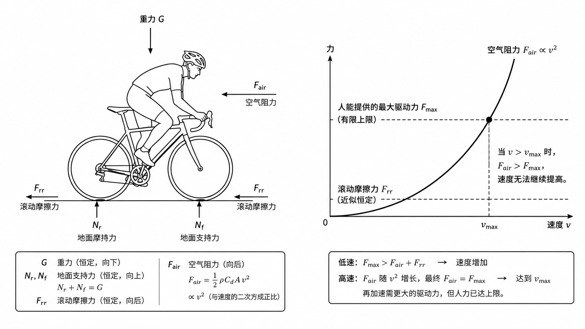
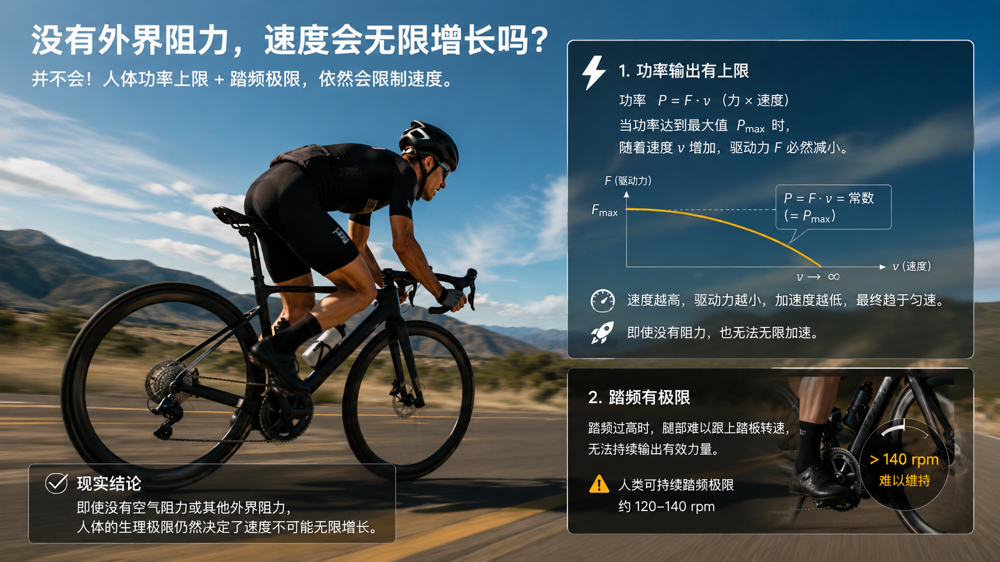

# 离谱念头的出现

不久前，我脑海中冒出了一个相当离谱的想法：如果一个人能够对脚踏持续施加恒定的力，根据牛顿第二定律 \( F=ma \)，加速度就会保持恒定，进而速度应该可以无限增长。然而，事实却并非如此。无论我如何用力，当自行车达到一定速度后，速度似乎再也无法提升。是什么阻碍了我“骑车飞出地球”的梦想呢？

作为一个上过学的人（尽管专业和这个问题无关），我觉得自己连这种基本问题都不清楚实在说不过去。于是，我决定好好探究清楚背后的原理。经过查阅资料发现，要完整解释清楚这个问题，涉及的理论可能有些复杂，不过幸好，借助初中物理知识，也能找到一个简化版的解答。

---

# 受力分析

先来看自行车和人的整体受力情况。地球自然会对我们施加一个重力，方向垂直向下，这个力是恒定的。同时，自行车的车轮与地面接触时，会受到两个作用力：其一是地面对车轮的垂直支持力（等于重力，但方向相反），这一力也是恒定的；其二是与运动方向相反的摩擦力，主要表现为滚动摩擦，根据近似模型，这个力可以看作恒定。

然而，关键制约速度的并不是这些，而是空气阻力。随着速度的增加，空气阻力以速度的二次方增长，这意味着抵消空气阻力所需的驱动力会成倍增加。而人的力量增长却是有限的，无论怎么努力蹬踏，最终都会到达输出上限。因此，在高速度下，人已经无法提供足够的驱动力来对抗不断增大的空气阻力，速度自然也无法继续提高。

---

# 踏频的限制

假设一种极端情况：你是一个力量惊人的“超人”，有无穷大的力量来克服任何程度的空气阻力。那么这样的情况下，速度是否真能无限增加呢？答案依然是否定的。

原因在于机械性质的限制——踏频。假如你的齿比是固定的，那么速度越快，对应的转速也必须越高。而人的腿部肌肉能维持的踏频总是有极限的。当你达到这个极限，即便你的力量足够强大，也无法再增加速度。因此，从机械角度来看，这同样会限制你进一步提升速度。

---

# 更进一步的思考

那么，如果假设没有空气阻力或任何其他类型的外界阻力，是否速度就真的可以无限增长呢？这看起来仍然是不可能的。

原因之一，是人体本身功率输出存在上限。人体依靠细胞代谢和能量转化提供动力，但这些生成能量的化学反应是有速率限制的，所以人类输出功率也有最大值。熟悉物理的人知道，功率 \( P=F \* V \)（力乘以速度）。在功率已经达到最大值时，随着速度继续增加，你能施加在车上的驱动力 \( F \) 会逐渐减小，从而让加速度变低。

除了功率制约，踏频问题依旧无法绕开。即便假设你的功率可以无限提升来保持驱动力，当接触点越来越快地旋转时，你还是难以让双腿跟上踏板的高转速。即使使用更高踏频的机械装置，如何使这个装置达到无限的速度又是一个问题，而且我们目前的问题也是如何让自行车牙盘曲柄组这种机械达到无限的速度，问题陷入无限递归了。

---

# 小结

通过简单的物理分析发现，阻碍我们“骑车飞出地球”的因素相当多。其中包括空气阻力、人体力量输出能力的极限、机械传动效率，以及人体自身生理性能如踏频等的不完美。或许很多看起来“离谱”的问题，其实都蕴含着许多朴素而深刻的道理。理解这些规律，不仅有趣，还能帮助我们更好地认识世界的边界与奇妙之处。
