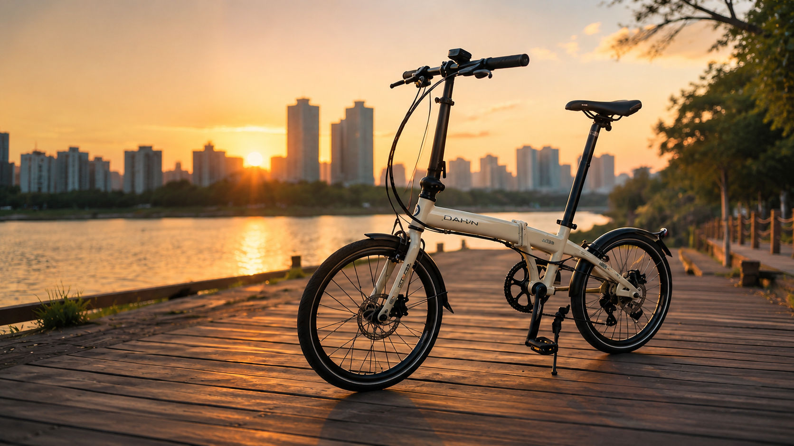
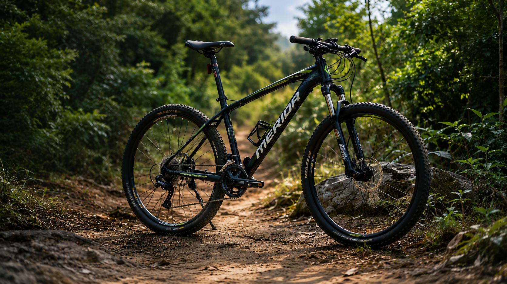
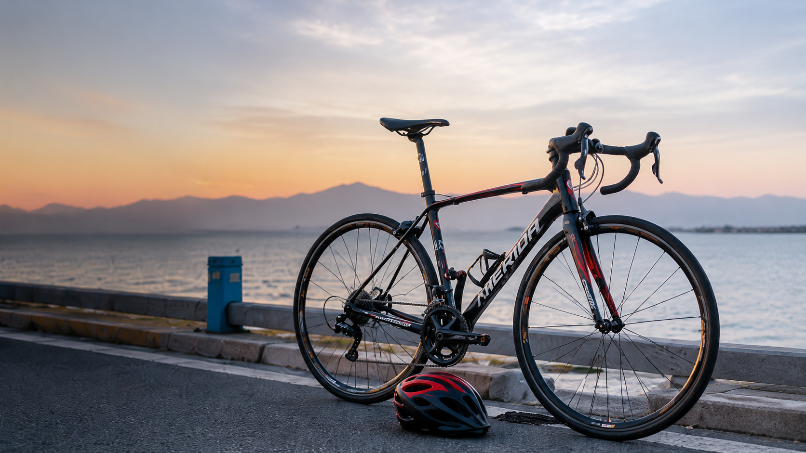
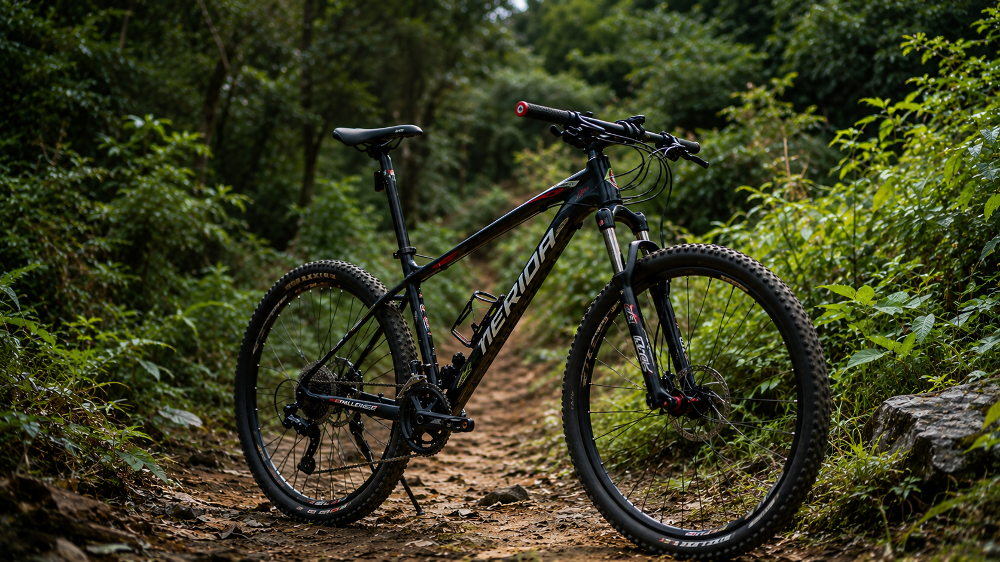
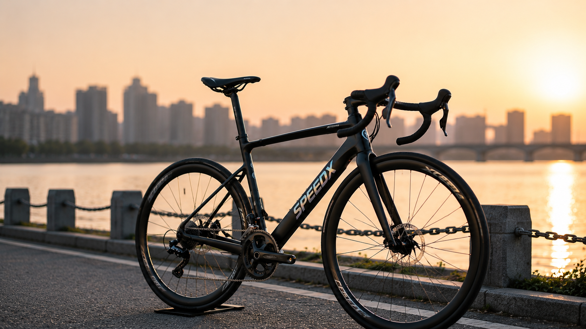
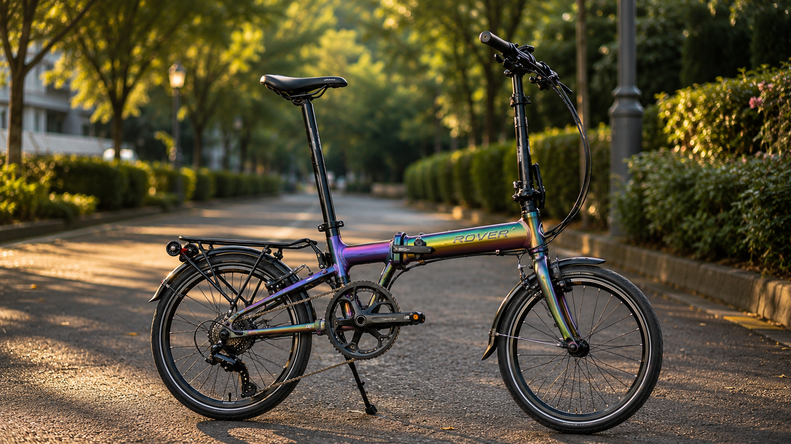

# 骑行的起点

早已记不起自己为何会突然想要买一辆自行车了，只隐约记得，那时是在逛某个论坛时，无意间看到“公路车吧”。尽管当时我对公路车这个概念还一无所知，但在潜意识里似乎已经种下了买一辆车的念头。后来某一天，不知受了什么刺激，我竟然问了同事在骑什么车。他告诉我是一辆大行折叠车，于是2024年四月底的某个下午，我路过家附近的大行专卖店，没能控制住自己的冲动，直接一咬牙把车推回了家。

那时候其实并不明确自己的需求，只是挑了一个颜色稍微特殊、搭载碟刹系统的款式，花了3800块，妥妥交了钱。

拿到车后，我开始琢磨怎么去改装它。这可能是因为我从小就喜欢动手改造自己的东西，尽管结果未必总能提升效果。捣鼓了一番后，发现骑行体验虽然轻快了一些，但整体感觉却变得很别扭，重心好像不太对，总觉得踩快一点就不太稳当，甚至有点害怕。

---

# 喜提山地车

日子久了，我开始觉得折叠车的不足之处太多，例如稳定性无法满足高强度的骑行需求。这时，我动了换一辆非折叠车的念头，可又担心放在楼下会被偷。于是决定先买一辆价格便宜但品牌靠谱的。刚好家附近有一家美利达专卖店，据说服务不错，便过去看了看。店虽不大，但老板却很热情，聊着聊着我花了1800买下了一辆最基础款的勇士300。

骑上这辆山地车时，没觉得它有多笨重，甚至与之前的折叠车一样轻快。整体感觉还不错，只是前拨变速有时候会出问题。有一次加班后骑车回家，三盘前拨突然失灵，结果链条卡住，当时差点以为回不了家了。这个经历让我再一次萌生了换车的想法。

---

# 首次转型公路车

终于，在骑了一阵子后，我以1100元的价格将勇士300更换成一辆公爵300s，这也是在同一家店置换的。这次的新车外观让我眼前一亮，性能也较前一辆有了显著提升。可骑了一段时间，到了11月，又觉得这辆车蹬起来有些吃力。听从老板建议，我换了光头胎，确实轻快了一些，但显然还是满足不了我的需求。这时，我又对山马车产生了兴趣。但那时对自组还没信心，所以继续在成品车里挑。在多方考量后，我在2025年2月入手了一辆平把公路车Speeder 300。

骑上Speeder 300后，我切身体验到了它的与众不同，这种轻快是山地车无法带来的。然而，我逐渐发现，无论我怎样努力，这辆平把公路始终无法与正儿八经的弯把公路车相比。在小区楼下观察了一阵子后，却发现几乎没有人停放弯把公路车，这让我担心停在楼下会不会太过显眼，容易引来不必要的麻烦。于是我决定退而求其次，从闲鱼上淘了一辆战斗成色的美利达斯特拉King。

有了公路车后，我的平路极速首次突破了40公里/小时。这辆车很轻便，但骑行姿势比我想象中还要战斗，实际骑起来并不是特别让人安心。此外，圈刹的制动力总觉得不够，有几次差点撞车，不过，速度方面确实快得让人兴奋。

---

# 再次喜提山地车

到了8月，我渐渐对手头这两辆车的“战斗氛围”失去了兴趣。刚好又听说挑战者300即将更新桶轴，突然想起当初骑公爵300跑泥巴路的日子，颇为怀念，所以索性直接又换了一辆车。

重新换回山地车后，速度明显降了下来，心率飙高但速度还是难上30。不过，骑行姿势却舒服了许多。之后，我用它跑了几次泥巴路，越野的乐趣重新燃起了热情。为了提升速度，我换装了顶级的山马胎，果然改装后速度有所提升。但事情很快出现了变数——我得搬家了，新家附近却找不到合适的停车地点，只能暂时将车放在楼道里。

---

# 再次尝试公路车

某天突发奇想，我突然意识到自己还没试过碟刹公路车。刚好新家附近有一家速比特，于是决定入手一辆阿童木。然而骑了一段时间后发现，这车的刹车和之前的圈刹竟然一样不给力，好几次险些追尾。为此，我专门去了车店维修，但老板检查后表示车辆没有问题。不过，他的态度让我感觉有些被嘲讽，从那以后，我就不愿再和那家店有任何瓜葛了。

---

# 最终改回折叠车

后来，楼道里贴出了禁止存放物品的通知，而且总有人动我的车，实在让我无法接受。于是，我索性决定把所有车都处理掉。而就在这个时候，我在楼下发现了一个便民存储仓，觉得存放一辆折叠车会非常合适。经过多年经验积累，这时的我已经不怕自组车辆了，于是最终选了风行。

风行确实是一辆不错的车，变色龙的渐变色很帅，单盘大飞爬坡不虚，虽然偶尔有点异响，但提速后并不像大行那样给人飘忽不稳的感觉。然而，它的头管稍微有点软，于是我想着要不要再换一辆骑行体验更好的折叠车。经过一番研究和考量，最后选择了bikefriday。

不得不说，bikefriday确实不便宜，但它的性能和独特性完全值回票价。骑着它会感受到和公路车一样轻快顺畅的体验。虽然折叠性能稍微逊色一些，但好歹它还能折。这是我骑过手感最好的一辆车，也非常符合我的审美。在配件搭配上，我结合这些年的经验选择了一些性价比极高的部件。如果以后经济条件允许，我可能会升级一些更高端、更酷炫的配件。

_（文章内AI仅用于生成配图及润色）_
