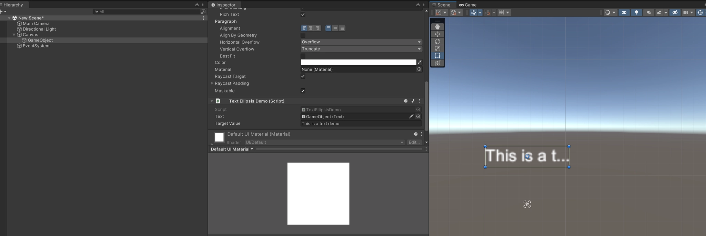
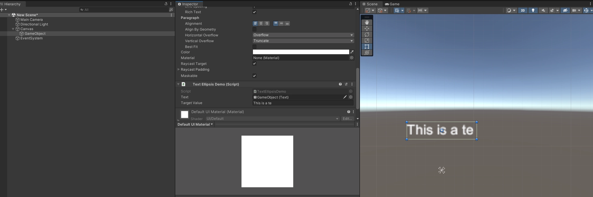
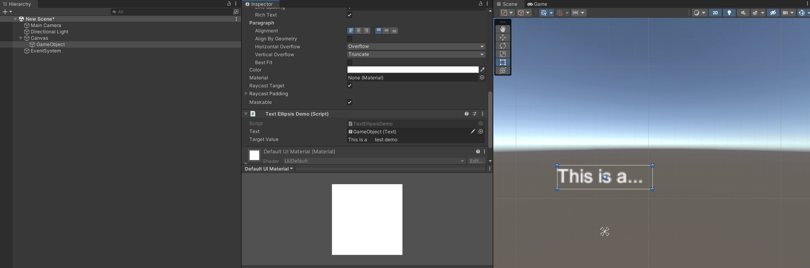

# 背景介绍

之前遇到一个需求，要用一行文本显示玩家名字，如果玩家名字超出一个宽度，就自动截断并补充省略号。

众所周知，Unity的TMP组件自带超出宽度自动补省略号的功能。然而玩家名字可以是任意语言的，一旦涉及多语言文本，就会出现一些字符显示不出来的问题，而用原生的Text能通过系统字体避免这个问题，但自动补省略号功能也一起没了。

看了[网上的一些文章](https://blog.csdn.net/Ling_SevoL_Y/article/details/126263397)，大多数都在说可以使用TextGenerator类，里面有个TextGenerator.characterCountVisible属性，可以通过可见字符数和实际字符数对比，截取多余的字符并且补上省略号。然而理想和丰满，现实很骨感。尝试之后发现TextGenerator.characterCountVisible在即使真的没显示全的情况下，也和字符本来的长度一样，原因未知。

# 解决方案

查阅Unity官方API文档，发现TextGenerator还有个GetPreferredWidth方法，于是有了个想法，是不是拿这个宽度和实际宽度对比，然后去除多余宽度内的字符就行了呢，不过这样就需要知道每个字符的宽度，TextGenerator有个GetCharactersArray方法，数组里面的UICharInfo类，有个charWidth字段，看起来就是这个宽度。试了一下，似乎成了。


超过宽度的文本自动补省略号


未超过宽度的文本完整显示


截掉省略号前面多余的空格

附上源码，不过目前没有仔细测过，可以试试看~

```csharp
private void SetTextTruncateWithEllipsis(Text txt, string value)
{
	var rectTransform = txt.transform as RectTransform;
	if (rectTransform == null)
	{
		return;
	}
	
	Vector2 selfSizeDelta = rectTransform.sizeDelta;
	//拿到文本组件RectTransform的宽度
	float selfWidth = selfSizeDelta.x;
	
	//获取文本组件上序列化的配置
	var settings = txt.GetGenerationSettings(selfSizeDelta);
	
	var generator = new TextGenerator();
	//计算填充文本需要的宽度
	float preferredWidth = generator.GetPreferredWidth(value, settings);
	
	//超出RectTransform部分的宽度
	float overFlowWidth = preferredWidth - selfWidth;
	if (overFlowWidth > 0)
	{
		generator.Populate(value, settings);
		var allUiCharInfo = generator.GetCharactersArray();
		
		int decreaseCharCount = 0;
		for (int i = allUiCharInfo.Length - 2; i >= 0; i--)
		{
			if (overFlowWidth <= 0)
			{
				//如果删掉超过RectTransform部分的宽度的字符后，挨着省略号的文本是空格，那继续删字符
				if (!char.IsWhiteSpace(value[i]))
				{
					break;
				}
				
				decreaseCharCount++;
			}
			
			if (overFlowWidth > 0)
			{
				//从后向前逐个删文本，直到不超过RectTransform部分的宽度，记录删掉的字符
				overFlowWidth -= allUiCharInfo[i].charWidth;
				decreaseCharCount++;
				if (overFlowWidth <= 0)
				{
					//从不超格最后一个文本的前一个文本开始计算空格数
					//因为最后一个文本肯定是要被替换成省略号的
					i--;
				}
			}
		}
		
		//让文本在同一行显示
		txt.horizontalOverflow = HorizontalWrapMode.Overflow;
		txt.text = value.Substring(0, value.Length - decreaseCharCount - 1) + "...";
	}
	else
	{
		txt.text = value;
	}
}
```
